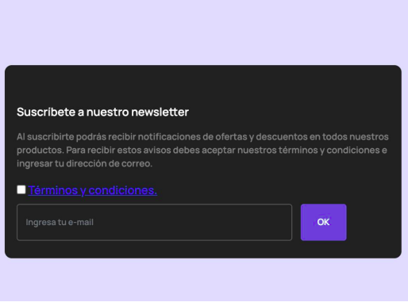

# INSCRÍBETE A NUESTRO NEWSLETTER

EJERCICIO:
Actualmente, es común que las tiendas y empresas tengan una lista de correos a los cuales le envían
información, novedades, o promociones, llamadas Newsletters. En este sentido, una empresa de
Richter utiliza dicho mecanismo de marketing para incentivar a los clientes a que compren en sus
tiendas; y recientemente actualizaron sus términos y condiciones. Para asegurarse de que sus
clientes los entiendan y acepten antes de inscribirse a su Newsletter, te han contratado para que
desarrolles una función o algoritmo que pueda dar solución a esta problemática.

